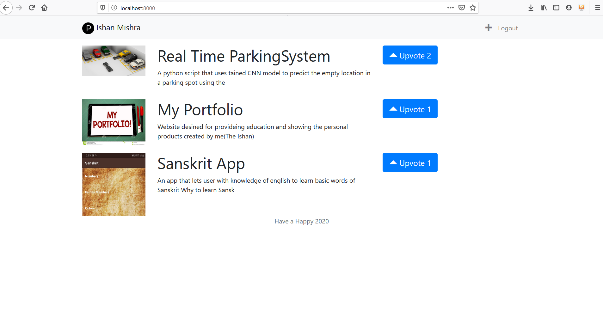

# Product Hunt Clone

A basic clone of <a href="https://www.producthunt.com/">Product</a> Hunt website

# Tools/Languages Used
  
  * Django framework(Python based) is used as a backend <a href='#'>See Tutorial Here</a>
  * HTML/CSS, JavaScript <a href='#'>See Tutorial Here</a>
  
# Images

  
# Prerequisites
  * Django for backend
  * Basic CSS/HTML for frontend
  * Python
  

  
  

  

