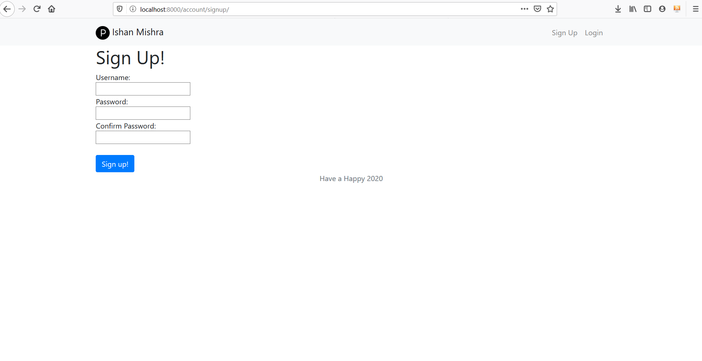

# Product Hunt Clone

A basic clone of <a href="https://www.producthunt.com/">Product Hunt</a> website

# Tools/Languages Used
  
  * Django framework(Python based) is used as a backend <a href='#'>See Tutorial Here</a>
  * HTML/CSS, JavaScript <a href='#'>See Tutorial Here</a>
  
# Images

  
# Prerequisites
  * Django for backend
  * Basic CSS/HTML for frontend
  * Python
  
# Getting Started

   1.Fork it!

   2.Clone the forked repository to local system.
   
   3.Read issues and solve it, or add your own issues 😊

   4.Commit your changes: git commit -m 'Add some feature'.

   5.Push to the <a href="https://github.com/noobDevelopers/product_hunt/tree/feature">feature</a> branch

   7.Submit a pull request 😄

  

  
  

  

